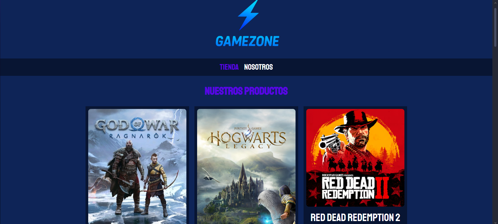
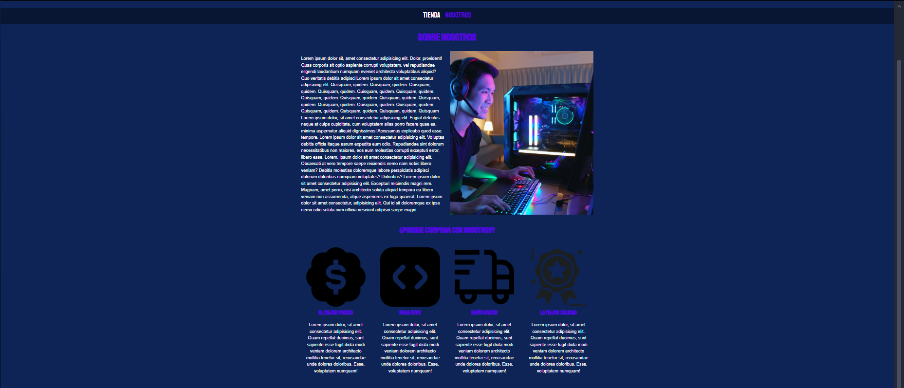
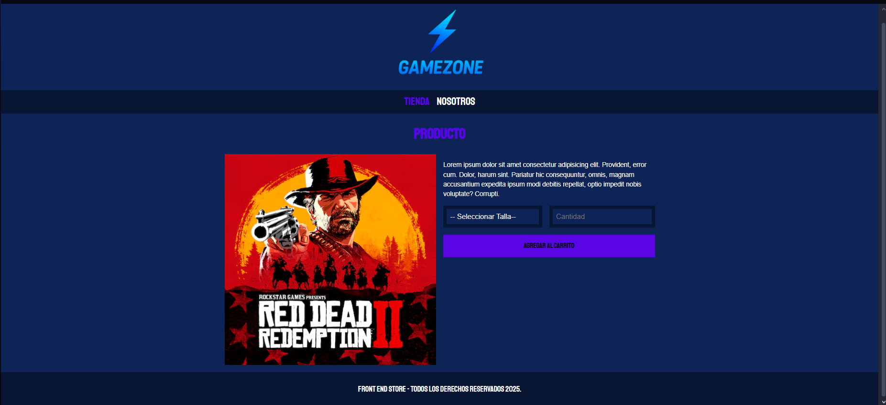

# GameZone

**GameZone** es una tienda de videojuegos creada como parte de mi portafolio web.  
Está enfocada en mostrar un diseño moderno, limpio y organizado, aplicando la metodología **BEM** en CSS para mantener una estructura clara y fácil de escalar.

---

## Vista previa

**Pagina principal**

**Pagina nosotros**

**Pagina individual**

---

## Sobre el proyecto

Este proyecto representa el **front-end** de una tienda online de videojuegos.  
Incluye una página principal con productos, una sección “Nosotros” y una vista para el juego.  
Fue desarrollado con un enfoque en la práctica del maquetado web y buenas prácticas en CSS.

---

## Tecnologías utilizadas

- **HTML5**  
- **CSS3**  
- **Metodología BEM**  
- **Normalize.css**  

## Visita el proyecto

Puedes visitar el sitio en:  
[frontend-store-edson.netlify.app](https://frontend-store-edson.netlify.app)
